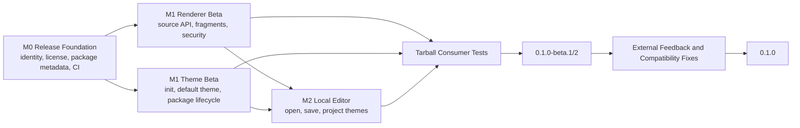

# MDS Release Plan

Status: in progress

Last updated: 2026-08-14

This document defines the product, development, packaging, and release work required before MDS is published for external users. It covers three release goals:

1. External theme authors can define, build, publish, and consume custom MDS themes as packages.
2. External users can open, inspect, edit, preview, and save `.mds` files with the MDS Editor.
3. Other developers can integrate the MDS HTML renderer into Node.js, browser, and framework projects without depending on monorepo internals.

The recommended first public milestone is `0.1.0-beta.1`, not an immediate stable `0.1.0` release.

## Confirmed Release Decisions

- The npm organization and package scope is [`mds-crate`](https://www.npmjs.com/settings/mds-crate/packages).
- All scoped packages use the `@mds-crate/*` namespace.
- The command-line executable remains `mds`; changing the npm scope does not change document syntax or CLI commands.
- Project code and bundled themes use the Apache License, Version 2.0.
- Public packages require Node.js 20.19 or newer; release CI uses Node.js 24.
- The first package metadata baseline is `0.1.0-beta.0`, with tightly coupled packages kept on the same version during the initial beta.

## M0 Progress

- [x] Confirm the `@mds-crate` npm scope and migrate workspace package identities.
- [x] Adopt Apache-2.0 and add root license, security, contribution, and project overview documents.
- [x] Set the public package baseline to `0.1.0-beta.0` and Node.js `>=20.19.0`.
- [x] Add public package metadata, npm file allowlists, package README files, and React SDK peer dependencies.
- [x] Clean production builds and remove compiled test artifacts before pack.
- [x] Add sequential tarball auditing, including packed-manifest checks for leaked `workspace:` dependencies.
- [x] Verify the planned npm package names are not already published under `@mds-crate`.
- [x] Install all packed packages in a clean temporary consumer, import the library entry points, and execute the packed CLI.
- [ ] Make the GitHub repository public before the external beta.
- [x] Add Changesets lockstep versioning and release pull-request automation.
- [x] Add GitHub Actions for type checks, tests, builds, tarball auditing, and visual smoke tests.
- [ ] Add trusted npm publishing after the package bootstrap release.
- [x] Add the clean Editor consumer fixture alongside the Node.js, Vite, CLI, and Theme tarball consumers.

## M1A Progress

- [x] Add `renderMds` and `renderMdsResult` source-string APIs while preserving the AST APIs.
- [x] Add document and fragment modes with separate body, head, CSS, and JavaScript results.
- [x] Neutralize unsafe URL schemes across Markdown links/images and MDS action/media output.
- [x] Add mixed-case, encoded-URL, source-content, data-block, and theme-template XSS fixtures.
- [x] Document the renderer URL allowlist and trusted-theme boundary.
- [x] Prepare a portable `@mds-crate/theme-default` package for publication.
- [x] Add clean Node.js and Vite integration fixtures for the new public API.
- [x] Tighten the Editor preview iframe sandbox by removing same-origin and popup capabilities.

## M1B Progress

- [x] Add `mds theme init` and `mds-theme init`.
- [x] Provide artifact-first HTML, JSX, and React authoring templates.
- [x] Build `@mds-crate/theme-default` as both a browser-safe module and a Node-resolvable artifact package.
- [x] Exclude theme source and development build metadata from published theme packages.
- [x] Test init, dependency installation, build, inspect, pack, package-name resolution, rendering, and Vite bundling from tarballs.
- [ ] Bootstrap the packages on npm and run the same acceptance flow against registry versions.

## M2 Progress

- [x] Add `mds edit <file-or-directory>` with automatic browser launch, `--no-open`, free-port selection, and clean signal shutdown.
- [x] Bundle the production Editor application inside the CLI tarball.
- [x] Add real file selection, creation, atomic save, `Cmd/Ctrl+S`, dirty state, and unsaved replacement warnings.
- [x] Detect external modification by content revision and require an explicit reload or overwrite decision.
- [x] Resolve project theme directories, installed npm theme packages, and the bundled default theme.
- [x] Protect the loopback service with a session token, Host/Origin checks, body limits, and a project-root file jail.
- [x] Reject traversal, absolute paths, symbolic-link files, and symlink escapes.
- [x] Add service integration tests and a packed-CLI browser E2E covering save, conflict, reload, installed themes, diagnostics, and shutdown.
- [ ] Run the Editor acceptance flow against registry-published packages after npm bootstrap.

## Release Principles

- Design and test complete external user journeys, not only individual npm packages.
- Test published tarballs in clean consumer projects so workspace links cannot hide packaging failures.
- Keep the runtime artifact contract plain: `theme.json`, block templates, CSS, optional JavaScript, and optional shell/head assets.
- Keep package-theme source execution in trusted development/build workflows. Runtime rendering consumes built artifacts only.
- Ship one supported default path for each audience before expanding the option matrix.
- Treat MDS content as potentially untrusted input and themes as trusted executable/build input.
- Keep the first public release ESM-only unless real consumer evidence requires CommonJS.

## Current Readiness Assessment

| Release Goal | Recommended Product | Current State | Release Blockers |
| --- | --- | --- | --- |
| External package-defined themes | `@mds-crate/theme-builder`, theme SDKs, `@mds-crate/blocks`, `@mds-crate/theme-default`, and `mds theme` commands | HTML/JSX/React scaffolds, build/watch/inspect/pack, artifact validation, shared block composition, a portable default theme, package-name resolution, and tarball lifecycle tests exist. | Packages are not yet bootstrapped on npm, and registry-version acceptance has not run. |
| External `.mds` file editing | `mds edit <file-or-directory>` backed by the built Editor app | The CLI bundles a production local server and static app with real open/create/save, dirty/conflict UI, atomic writes, project/package themes, a root-jailed API, a restrictive preview sandbox, and packed browser E2E coverage. | Registry-version acceptance remains after the npm bootstrap publication. |
| Renderer integration | `@mds-crate/renderer-html` plus `@mds-crate/theme-default` and advanced `@mds-crate/theme-loader` APIs | Source and AST rendering, document/fragment output, separate theme assets, a portable default theme, deterministic diagnostics, URL neutralization, and clean Node/Vite consumers exist. | Registry-version acceptance remains. |

Current evidence:

- [`@mds-crate/renderer-html`](../packages/renderer-html/src/index.ts) now exposes source-string and AST APIs, including embeddable fragment output and separate theme assets.
- [`@mds-crate/editor`](../apps/editor/package.json) remains private; its production assets are built into the public CLI distribution.
- The [Editor app](../apps/editor/src/app.tsx) keeps the example playground for development and switches to real file sessions under `mds edit`.
- The CLI [production server](../packages/cli/src/editor-server.ts) owns theme/file APIs, security checks, persistence, and packaged static assets; the Vite plugin remains the development adapter.
- [`@mds-crate/theme-default`](../themes/default/package.json) is public-ready and exports both a browser-safe module and `dist/theme` artifact.
- Public package manifests now use the `0.1.0-beta.0` baseline and include publishing metadata and `dist` file allowlists.
- Sequential package audits now verify clean tarball contents and packed manifests without leaked `workspace:` dependency ranges.
- The GitHub repository is currently private; the working tree now contains the Apache-2.0 license and release documentation that must land before it becomes public.

## Recommended Public Package Topology

### Primary entry points

These packages should be documented as the normal public entry points:

| Package | Audience | Responsibility |
| --- | --- | --- |
| `@mds-crate/renderer-html` | Application developers | Parse-and-render convenience APIs, AST rendering, fragment/document output, and renderer diagnostics. |
| `@mds-crate/theme-default` | Application developers and editor users | A supported default theme available as both a Node-resolvable artifact and a browser-safe module. |
| `@mds-crate/cli` | Authors and local editor users | `build`, `check`, `edit`, and delegated `theme` commands. |
| `@mds-crate/theme-builder` | Theme developers | Theme build, watch, inspect, pack, and initialization workflows. |
| `@mds-crate/theme-sdk-html` | Theme developers | Tagged-HTML theme authoring. |
| `@mds-crate/theme-sdk-react` | Theme developers | Build-time React theme authoring. |
| `@mds-crate/blocks` | Theme developers | Shared block vocabulary, profiles, and reusable structural templates. |

### Advanced or supporting packages

These packages still need to be public because they appear in runtime or type dependency graphs, but they should be documented as lower-level APIs:

- `@mds-crate/ast`
- `@mds-crate/html-types`
- `@mds-crate/parser`
- `@mds-crate/theme-loader`

### Packages that should remain private initially

- `@mds-crate/editor` should remain a workspace application. Its production assets should be bundled into the CLI/editor distribution rather than exposing the React app as a public component-library API.
- `@mds-crate/theme-folio`, `@mds-crate/theme-atelier`, `@mds-crate/theme-clarity`, and `@mds-crate/theme-canvas` should remain repository examples for the first release.
- Only `@mds-crate/theme-default` should become a supported published theme in `0.1`.

## P0: Shared Release Foundation

These tasks block all three public user journeys.

### 1. Complete identity, visibility, and license setup

- The npm `@mds-crate` scope is confirmed. Verify each individual package name before its first publication.
- Decide whether `ziyu/mds` will become a public repository.
- Keep Apache-2.0 license metadata and the root license text aligned across public packages.
- Add a root `README.md` that leads with three quick starts: render MDS, edit an MDS file, and create a theme.
- Add `SECURITY.md` and a minimal contribution/release policy.
- Add `repository`, `bugs`, `homepage`, `license`, `description`, and `keywords` metadata to publishable packages.
- Make each package's `repository.url` match the GitHub repository used for trusted publishing.

The repository can publish public npm packages while remaining private, but automatic public provenance requires a public repository. See npm's [Trusted Publishing documentation](https://docs.npmjs.com/trusted-publishers/).

### 2. Make npm packages intentional

For every public package:

- Keep package versions managed by Changesets from the `0.1.0-beta.0` baseline.
- Add a `files` allowlist, normally `dist`, plus package-local documentation when needed.
- Add `publishConfig.access = "public"` for scoped public packages.
- Add an explicit supported Node.js range.
- Keep `exports` as the public API boundary.
- Add `sideEffects: false` only to packages that are actually side-effect free.
- Run a clean build before packing.
- Exclude `*.test.*` from production TypeScript output.
- Prevent stale files from remaining in `dist`.
- Add `prepack` validation.
- Verify that bin files retain their shebang and executable mode.

The npm rules for `files`, `private`, `exports`, and `publishConfig` are documented in the official [package.json reference](https://docs.npmjs.com/files/package.json/).

### 3. Define compatibility and version policy

- Freeze and label the initial MDS syntax contract as v0.1.
- Keep Theme Artifact version 1 as the first public artifact contract.
- Define AST compatibility expectations for the `0.1` line.
- Publish the first external build under the `next` dist-tag.
- Keep tightly coupled core packages in a fixed/lockstep Changesets group during `0.x`.
- Keep exact internal dependency versions during the first beta unless independent-version compatibility is explicitly tested.
- Require changesets and migration notes for public API changes.
- Document that the first release is ESM-only.

### 4. Add clean-consumer package tests

CI must pack packages and install the tarballs into temporary projects outside the workspace.

Required fixtures:

- [x] Node.js ESM renderer consumer.
- [x] Vite/browser renderer consumer.
- [x] CLI consumer invoking the installed `mds` bin.
- [x] Theme-author project created by the official scaffold.
- [x] Theme-consumer project installing a packed theme by package name.
- [x] Local Editor consumer opening and saving a real `.mds` file.

Each fixture must use packed tarballs, not workspace paths or symlinks.

## P0: Renderer Integration Product

The first integration product should extend `@mds-crate/renderer-html` instead of introducing another facade package.

### 1. Add source-string convenience APIs

Recommended public API:

```ts
interface RenderMdsOptions extends RenderHtmlOptions {
  mode?: "document" | "fragment";
}

interface RenderMdsResult {
  document: DocumentNode;
  html: string;
  body: string;
  head: string;
  css?: string;
  js?: string;
  diagnostics: Diagnostic[];
}

function renderMds(source: string, options?: RenderMdsOptions): string;
function renderMdsResult(source: string, options?: RenderMdsOptions): RenderMdsResult;
```

Requirements:

- Preserve the existing AST-based `renderHtml` and `renderHtmlResult` APIs.
- `document` mode produces standalone HTML.
- `fragment` mode produces embeddable body output and returns theme assets separately.
- Parser, renderer, and theme diagnostics have deterministic ordering and source metadata.
- The API behaves the same in Node.js and browser bundlers when given the same `HtmlTheme`.

### 2. Publish a portable default theme

`@mds-crate/theme-default` must support both consumption modes:

```ts
// Browser or bundled application
import { theme, themeSource } from "@mds-crate/theme-default";

// Node theme registry
await readThemeRef("@mds-crate/theme-default");
```

The published package should contain:

- the plain artifact under `dist/theme`;
- a browser-safe generated module;
- types for its module export;
- `package.json#mdsTheme.dist`;
- an explicit `./package.json` export if the resolver contract requires it.

### 3. Harden renderer security

Before external release:

- [x] Reject or neutralize `javascript:` and other executable URL schemes in action links.
- [x] Define allowed schemes for navigation, images, audio/video, downloads, and embeds.
- [x] Add tests for encoded or mixed-case dangerous URLs.
- [x] Add XSS fixtures for frontmatter, Markdown, blocks, slots, data blocks, media directives, and theme placeholders.
- [x] Clearly document that theme JavaScript, theme head content, and executed theme source are trusted code.
- [x] Review the Editor preview sandbox and remove `allow-same-origin`; retain only scripts and forms.

### 4. Publish integration examples

Required examples:

- Node.js server rendering.
- Vite/browser rendering.
- React or Next.js fragment integration.
- Astro or another server-first framework.
- Custom block renderer override.
- Custom `HtmlTheme` and package theme loading.

Renderer beta acceptance:

```ts
import { renderMdsResult } from "@mds-crate/renderer-html";
import { theme } from "@mds-crate/theme-default";

const result = renderMdsResult(source, {
  theme,
  mode: "fragment"
});
```

This must type-check, bundle, and render from packed npm tarballs in clean Node.js and Vite projects.

## P0: External Theme Authoring Product

### 1. Add `mds theme init`

Supported commands:

```sh
mds theme init my-theme
mds theme init my-theme --template html
mds theme init my-theme --template jsx
mds theme init my-theme --template react
```

Every generated project must contain:

- a valid public npm package manifest;
- separate `src/` and `dist/theme/` directories;
- build, watch, inspect, pack, and prepack scripts;
- a `files` allowlist;
- a preview asset;
- a minimal README;
- the correct SDK and `@mds-crate/blocks` development dependencies;
- a small theme-specific override set;
- one test or smoke command proving the artifact builds and inspects cleanly.

The default template should use the simplest file/HTML authoring mode. JSX and React should be explicit template choices.

### 2. Finalize the published theme-package contract

A public npm theme package must:

- declare `package.json#mdsTheme.dist`;
- include a complete runtime artifact;
- exclude `.mds-theme-build.json` from the distributable artifact;
- be resolvable by package name from the consuming project;
- work even when only build output, not source, is published;
- define how `exports` interacts with theme package discovery;
- place builder, SDK, React, and block-pack authoring dependencies in development or peer dependency sections as appropriate;
- run a build/inspect validation before pack or publish.

The React theme SDK should use compatible peer dependencies for React and React DOM rather than forcing one pinned runtime copy into every theme-author project.

### 3. Test the complete package lifecycle

The release test must perform this flow:

1. Generate a new theme with `mds theme init`.
2. Install dependencies.
3. Build and inspect the theme.
4. Pack the theme to a tarball.
5. Install that tarball into a separate MDS project.
6. Render an `.mds` file with `mds build --theme <package-name>`.
7. Verify the output uses theme templates, CSS, JavaScript, and shell assets.
8. Verify the consuming process never executes theme source.

### 4. Defer arbitrary package-config block pack resolution

The current builder resolves string block pack references only from built-in `@mds-crate/blocks` profiles. This does not block `0.1`: advanced package themes can import and compose third-party pack objects in TypeScript/JavaScript source.

Generic npm block pack references in `package.json#mdsTheme.blockPacks` should be a `0.2` feature because they require a separate package contract, resolution policy, compatibility policy, and trust model.

## P0: Local Editor Product

The recommended first Editor release is a local application launched through the CLI, not a static hosted editor.

### 1. Define the external command

```sh
mds edit ./page.mds
mds edit ./docs
```

The command should:

- bind only to `127.0.0.1` by default;
- start the packaged Editor server;
- open the browser automatically unless disabled;
- choose a free port;
- display the opened project root and active file;
- shut down cleanly on SIGINT/SIGTERM.

### 2. Add real file workflows

Required functionality:

- open an existing `.mds` file;
- create a new `.mds` file inside the allowed project root;
- save with `Cmd/Ctrl+S`;
- display clean/dirty state;
- warn before closing or replacing unsaved content;
- use atomic writes;
- detect external modification through mtime, revision, or content hash;
- offer reload/overwrite choices when a conflict occurs;
- preserve line endings where practical;
- prevent reads or writes outside the allowed project root;
- expose clear diagnostics when a file cannot be read or saved.

### 3. Replace development-only server assumptions

- Build Editor static assets as part of the repository build.
- Include those assets in the CLI/editor distribution.
- Move theme list/load, document read/write, and project configuration endpoints into a production local server adapter.
- Keep Vite-specific HMR as a development adapter, not the only implementation.
- Resolve local theme directories and installed npm theme packages relative to the opened project.
- Bundle `@mds-crate/theme-default` as the fallback when no project theme is available.
- Distinguish normal document-edit mode from theme developer mode.
- Hide theme build/inspect controls in normal mode unless explicitly enabled.

### 4. Protect the local editor boundary

- Use an unguessable session token or equivalent request protection for write endpoints.
- Validate Origin/Host where applicable.
- Bind to loopback only by default.
- Jail file APIs to the project root.
- Reject traversal and symlink escapes.
- Limit request body size.
- Treat installed theme packages and theme build source as trusted local code.
- Keep rendered preview content inside a restrictive iframe sandbox.

### 5. Add Editor end-to-end tests

The packed CLI test must:

1. Create a temporary project and `.mds` file.
2. Launch `mds edit` from the installed tarball.
3. Load the editor in a real browser.
4. Confirm the file contents appear.
5. Edit and save the file.
6. Confirm the disk contents changed.
7. Modify the file externally and verify conflict handling.
8. Switch to an installed theme package.
9. Verify parser, renderer, and theme diagnostics appear.
10. Verify shutdown releases the port and file handles.

## P1: Features Deferred Until After the First Beta

These are valuable but should not block the first complete external journeys:

- Hosted static/web Editor with browser file picker, upload/download, IndexedDB recovery, and restricted theme upload.
- A dedicated MDS CodeMirror language package with syntax highlighting, completion, hover documentation, and semantic diagnostics.
- Generic third-party block-pack package resolution from `mdsTheme.blockPacks`.
- Theme registry, gallery, search, and marketplace UX.
- Theme compatibility badges and artifact signature policy.
- Framework-specific renderer adapters beyond examples.
- Watch/streaming renderer APIs.
- CommonJS builds.
- Multiple officially supported visual themes.
- Formatter and linter packages.

## Release Automation

### Versioning

Use Changesets to manage:

- release intent in pull requests;
- fixed/lockstep versions for tightly coupled `0.x` packages;
- internal dependency updates;
- package changelogs;
- release pull requests;
- prerelease dist-tags.

pnpm recommends Changesets or Rush for workspace versioning. See the official [pnpm workspace release guidance](https://pnpm.io/workspaces/) and [Changesets repository](https://github.com/changesets/changesets).

### Pull request CI

Every pull request should run:

1. `pnpm install --frozen-lockfile`
2. type checks
3. unit/integration tests
4. full build
5. visual smoke tests
6. package tarball content validation
7. clean Node.js consumer test
8. clean Vite consumer test
9. CLI/theme lifecycle test
10. Editor end-to-end test when Editor or shared runtime packages change

### Publishing

Recommended publishing sequence:

1. Apply Changesets versions and changelogs in a release pull request.
2. Build and test from a clean checkout.
3. Run `pnpm pack` for public packages sequentially in dependency order. pnpm rewrites `workspace:` dependencies to publishable version references during pack. Packs must not run concurrently because package `prepack` builds clean their own `dist` directories while dependent packages may be compiling.
4. Publish the generated tarballs with the npm CLI from a GitHub-hosted runner.
5. Publish packages in dependency order and verify all expected versions are visible before moving the dist-tag.
6. Push package tags and create a GitHub release containing the changelog and tarball audit summary.

This deliberately combines pnpm packing with npm publishing. pnpm 11 implements `pnpm publish` natively rather than delegating to npm, while npm trusted publishing is defined around `npm publish`. See [pnpm publish](https://pnpm.io/cli/publish) and [npm Trusted Publishing](https://docs.npmjs.com/trusted-publishers/).

### Trusted publishing and provenance

For repeatable releases:

- use a GitHub-hosted runner;
- grant `contents: read` and `id-token: write`;
- use Node.js 24 in the release workflow;
- ensure npm CLI is at least 11.5.1;
- set the package repository metadata to the exact GitHub repository;
- configure a deployment environment with manual approval for stable releases;
- configure trusted publishing for each public npm package;
- remove long-lived publish tokens after trusted publishing is verified.

Trusted publishing generally requires the package to exist before the trust relationship is configured. The first publication is therefore a bootstrap operation and should use an explicitly reviewed manual or short-lived-token workflow. Subsequent releases should use OIDC.

Automatic public provenance requires a public source repository and public package. If the repository remains private, document that provenance will not be available even if OIDC publishing is used.

### One-time local environment issue

The current development machine reports root-owned files inside `~/.npm`, which prevents local `npm pack --dry-run`. This is not a repository defect and does not affect clean CI, but it must be repaired before using the local machine for the bootstrap npm publication.

## Package Publication Order

The release tool should calculate dependency order, but the expected first-release layers are:

1. `@mds-crate/ast`
2. `@mds-crate/html-types` and `@mds-crate/parser`
3. `@mds-crate/renderer-html` and `@mds-crate/theme-loader`
4. `@mds-crate/blocks`, `@mds-crate/theme-sdk-html`, and `@mds-crate/theme-sdk-react`
5. `@mds-crate/theme-builder`
6. `@mds-crate/theme-default`
7. `@mds-crate/cli` with packaged Editor assets

No stable dist-tag should be moved until every package in the release set has been published and the clean-consumer smoke suite passes against the registry versions.

## Milestones



### M0: Release foundation

Deliverables:

- package identity and npm scope confirmed;
- repository visibility and license decided;
- root README and security policy;
- package metadata normalized;
- Changesets configured;
- CI and tarball audit running;
- public API and Node.js support policy documented.

Exit criteria:

- all public packages pack cleanly;
- no tests or unintended source files appear in tarballs;
- clean fixture projects can install every tarball;
- no workspace protocol appears in packed manifests.

### M1A: Renderer beta

Deliverables:

- `renderMds` and `renderMdsResult`;
- document/fragment modes;
- portable `@mds-crate/theme-default`;
- URL/XSS hardening;
- Node.js and browser integration examples.

Exit criteria:

- clean Node.js and Vite consumers pass;
- full-document and fragment snapshots pass;
- dangerous URL and XSS fixtures pass;
- public types resolve without monorepo paths.

### M1B: Theme beta

Deliverables:

- `mds theme init` templates;
- finalized npm theme-package contract;
- public default theme package;
- end-to-end build/inspect/pack/install/consume test;
- theme author quick start.

Exit criteria:

- a developer can create and publish a theme without copying files from the MDS repository;
- a separate project can install and render with the packed theme by package name;
- runtime consumption never executes theme source.

### M2: Local Editor beta

Deliverables:

- `mds edit` command;
- production local editor server;
- real file open/create/save;
- dirty/conflict handling;
- project theme and installed theme resolution;
- packaged browser end-to-end tests.

Exit criteria:

- an external user can install the CLI, open a real `.mds` file, edit it, save it, reopen it, and preview with an installed theme;
- file APIs cannot escape the selected project root;
- Editor works without the repository's Vite development server.

### M3: Public beta and stable release

Recommended tags:

1. `0.1.0-beta.1`: the locally complete Renderer, Theme, and Local Editor journeys.
2. `0.1.0-beta.2` if needed: fixes from the first registry-package and external feedback cycle.
3. `0.1.0`: all three user journeys pass against registry packages and no blocking compatibility issue remains.

## End-to-End Release Acceptance

The release is ready for the stable dist-tag only when all three scenarios pass against registry versions.

### Scenario A: Theme author

```txt
install CLI or builder
  -> initialize theme package
  -> edit source
  -> build and inspect
  -> pack/publish
  -> install in another project
  -> render by package name
```

Acceptance:

- no repository checkout required;
- no workspace references required;
- no manual artifact copying required;
- output has no theme diagnostics or fallback blocks for declared support;
- final package contains only intended runtime/package files.

### Scenario B: MDS file editor user

```txt
install CLI
  -> run mds edit page.mds
  -> browser opens
  -> edit and preview
  -> save
  -> reopen and verify
```

Acceptance:

- the real file is loaded and saved safely;
- dirty and external-change states are visible;
- parser, renderer, and theme diagnostics are actionable;
- the selected project or npm theme loads correctly;
- no Vite development server or monorepo checkout is required.

### Scenario C: Renderer integrator

```txt
install renderer and default theme
  -> import source API
  -> render document or fragment
  -> inspect diagnostics
  -> integrate output into application
```

Acceptance:

- works in clean Node.js and Vite projects;
- no direct AST construction required for the normal path;
- fragment mode does not require string-parsing a complete HTML document;
- types and package exports resolve correctly;
- unsafe input fixtures do not create executable URLs or raw script injection;
- custom themes and block renderer overrides work through documented APIs.

## Open Decisions

These decisions should be made during M0 because they materially affect package names, automation, and documentation:

1. Will the GitHub repository become public before the beta?
2. Resolved: the stable Editor command is `mds edit`; no alias is required for the first beta.
3. Resolved: hosted Editor is deferred until after the local Editor beta.

Resolved: `@mds-crate/theme-default` exports both `theme` and `themeSource`, and npm theme packages are artifact-first.

## Recommended Next Work Order

1. Complete M0 release foundation.
2. Implement Renderer source/fragment APIs and security hardening.
3. Implement `mds theme init` and publishable default-theme output. Completed locally.
4. Add tarball consumer tests for Renderer and Theme. Completed locally.
5. Build the production local Editor server and file workflows using those released package contracts. Completed locally.
6. Run the first `next` publication and repeat all three journeys against registry packages. This is the next active release step.
7. Collect external feedback before moving to `latest`.

All three product journeys now pass locally and from tarballs. The remaining release work is npm bootstrap, registry-version acceptance, repository visibility/provenance, and external feedback.
